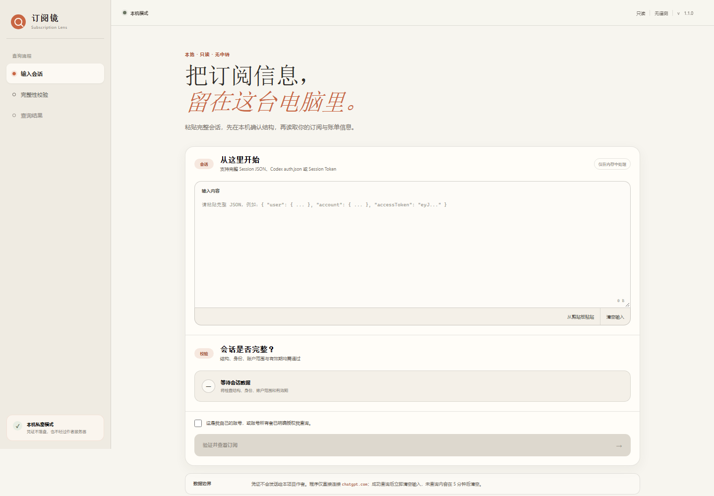
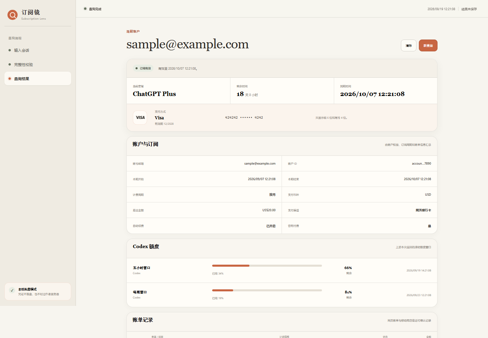

# 订阅镜（Subscription Lens）

一个本地运行、只读、可审计的 ChatGPT 订阅查询工具。把自己的 Session JSON、Access Token、Codex `auth.json` 内容或 session token 粘贴到程序中，即可在本机整理当前套餐、邮箱、计费币种、订阅周期、剩余时间、续费状态、网页账单和 Codex 额度。

> 当前版本：**v1.1.0**。本项目与 OpenAI、Apple、Google 没有关联，也不是官方产品。

## 界面预览

以下画面只使用本地假数据，不含真实凭证或账户信息。





## 为什么做成桌面程序

Session/Access Token 等同于账号临时密码。很多在线查询页会把它上传到自己的服务器。订阅镜没有中转服务：界面和解析逻辑都在本机运行，网络请求只允许发往 `https://chatgpt.com`，并且只调用读取类端点。

## V1.1.0 能做什么

- 在查询前严格检查 Session JSON、Access Token 或 Codex `auth.json` 是否包含可解析令牌、邮箱、用户 ID、ChatGPT 账户 ID 与有效期；残缺输入不能查询。
- Session Token 会先向 `chatgpt.com/api/auth/session` 换取完整会话，完整性验证通过后才读取订阅数据。
- 显示账号邮箱、账号 ID（界面脱敏）、套餐和当前状态。
- 显示订阅开始/结束、剩余时间、自动续费、支付来源、币种和最近金额。
- 显示 ChatGPT 网页直购账单端点实际返回的记录。
- 显示 ChatGPT 账户端点能够确认的最近一条 Apple App Store / Google Play 订阅记录。
- 网页银行卡支付可显示上游实际返回的 Visa/Mastercard 品牌及脱敏卡号；始终最多保留前 6 位和尾号 4 位。
- Apple App Store、Google Play、Visa 与 Mastercard 使用本地内嵌的单色品牌标识，不加载远程图片。
- 显示 Codex 配额窗口、已用/剩余比例和恢复时间。
- 每个数据源单独显示成功或不可用，避免把“没查到”伪装成“没有”。
- 没有购买、取消订阅、恢复续费、退款或修改支付方式的代码。

## 重要边界

OpenAI 没有发布“输入 ChatGPT session key 后查询个人完整订阅历史”的公开开发者 API。当前状态、计费周期、网页账单和额度来自 ChatGPT/Codex 客户端使用的内部只读端点，这些端点未来可能变化。

Apple 和 Google 管理各自商店中的完整购买历史。订阅镜只能展示 ChatGPT 账户返回的**最近可确认移动订阅**，不能保证列出 Apple/Google 的全部历史订单、退款和换号记录。完整记录请在 Apple/Google 购买历史中核对。参见 [调查报告](docs/RESEARCH.md)。

## 下载和运行

1. 从 [Releases](https://github.com/PascalePaF/chatgpt-subscription-lens/releases/latest) 下载 `SubscriptionLens-v1.1.0-windows-x64-setup.exe`。
2. 双击安装程序并完成当前用户安装；默认不需要管理员权限。
3. 从开始菜单运行“订阅镜”。
4. 应用自己的 WebView 数据保存在安装目录内的 `subscription-lens-data/WebView2`。
5. 需要移除时，从 Windows“设置 → 应用 → 已安装的应用”卸载。

Windows 10/11 通常已经包含 Microsoft Edge WebView2 Runtime。如果程序无法打开，请先从 Microsoft 官方渠道安装 WebView2 Runtime。

## 安全获取查询凭证

推荐使用 Session JSON：

1. 在浏览器中登录自己的 `https://chatgpt.com`。
2. 在**同一个浏览器配置文件**中打开 `https://chatgpt.com/api/auth/session`。
3. 页面若显示 JSON，复制全部内容并粘贴到订阅镜。
4. 查询后不要把这段内容发给任何人；不再需要时关闭页面并退出程序。

也可以粘贴 Codex 本地 `auth.json` 的完整内容。不要把 `auth.json`、Session JSON、Access Token 截图、提交到 GitHub 或发送给“客服/群友”。

更完整的说明见 [使用指南](docs/USER_GUIDE.md) 与 [隐私说明](PRIVACY.md)。

## 从源码构建

环境要求：

- Windows 10/11 x64
- Node.js 22+
- Rust stable（最低 1.77.2）
- Microsoft C++ Build Tools 与 WebView2 Runtime

```powershell
npm ci
npm run build
cargo test --manifest-path src-tauri/Cargo.toml
npm run tauri build
```

NSIS 安装程序会生成到 `src-tauri/target/release/bundle/nsis/`。Release 只分发安装版 Setup EXE，不再提供绿色免安装包。

## 技术与安全设计

- Tauri 2 + Rust + TypeScript，无远程网页、CDN 字体或分析脚本。
- Rust 客户端启用 HTTPS-only、禁止重定向、30 秒超时、5 MiB 响应上限。
- 请求地址在 Rust 中固定，前端不能传入任意 URL。
- 输入在 5 分钟闲置后自动清空；成功查询后立即清空。
- Rust 侧的原始输入和 Access Token 使用内存清零包装；不写日志、不写数据库。
- WebView 使用隐私模式，必要运行数据固定在安装目录内。
- 支付方式接口只保留显示所需的卡品牌、前 6 位、尾号 4 位和有效期；不会序列化或展示完整卡号。
- 内容安全策略只允许本地资源和 Tauri IPC。

源代码中的关键边界可从 [`upstream.rs`](src-tauri/src/upstream.rs)、[`credential.rs`](src-tauri/src/credential.rs) 和 [`tauri.conf.json`](src-tauri/tauri.conf.json) 开始审计。

## 开发与贡献

提交问题前请阅读 [CONTRIBUTING.md](CONTRIBUTING.md)。安全漏洞不要公开贴出真实凭证，按 [SECURITY.md](SECURITY.md) 说明报告。

## 许可证

[MIT License](LICENSE)。使用者必须只查询自己拥有或已获明确授权访问的账号，并自行承担内部端点变化和账号风控风险。
