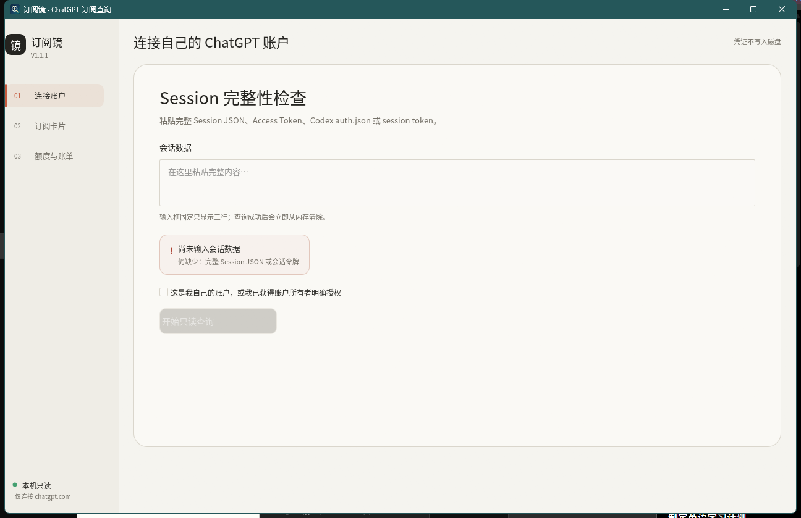
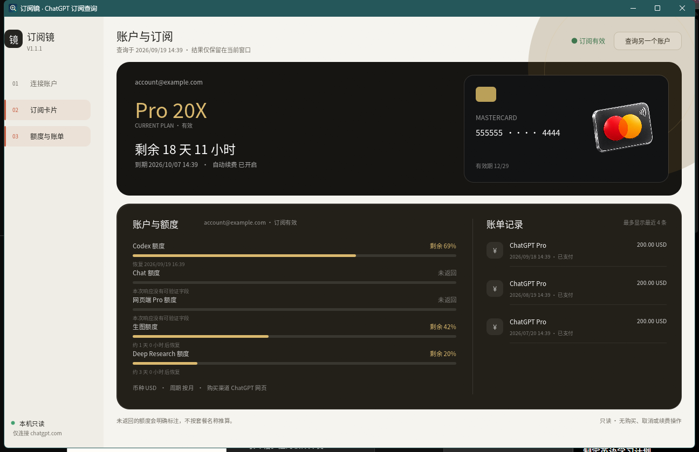

# 订阅镜（Subscription Lens）

一个真正原生、本地运行、只读、可审计的 Windows ChatGPT 订阅查询工具。把自己的 Session JSON、Access Token、Codex `auth.json` 内容或 session token 粘贴到程序中，即可在本机整理当前套餐、邮箱、订阅周期、剩余时间、支付方式、账单记录和可验证的额度信息。

> 当前版本：**v1.1.1**。本项目与 OpenAI、Apple、Google、Visa、Mastercard 没有关联，也不是官方产品。

## 原生界面预览

以下画面由 Windows 原生程序使用本地假数据直接生成，不含真实凭证或账户信息。





## V1.1.1 的桌面形态

- 纯 Rust + eframe/egui 原生窗口，不加载 HTML、CSS、JavaScript 或 WebView2。
- 固定 1280 × 800 单屏布局，没有页面级纵向滚动。
- 查询页只有三行高的 Session 输入区；查询成功或闲置 5 分钟后自动清除。
- 查询结果采用同屏“卡片正面 + 卡片背面”：正面展示套餐、剩余时间、到期时间和支付方式；背面展示账户、五类额度槽位和最近账单。
- 套餐配色固定：Pro 20X 黑金、Pro 5X 蓝色、Plus 绿色、Free 灰色。
- Visa、Mastercard、Apple App Store、Google Play 使用随程序内嵌的本地 3D 图标，不联网加载图片。
- 没有“数据来源”面板；内部端点失败时只在对应字段显示“未返回”，不会伪造结果。

## 查询能力

- 查询前检查 JSON/JWT 结构、邮箱、用户 ID、ChatGPT 账户 ID 和令牌有效期；残缺输入不能进入订阅查询。
- Session Token 会先向 `chatgpt.com/api/auth/session` 换取完整会话；远端仍缺字段时立即停止。
- 显示邮箱、套餐、订阅状态、开始/结束时间、剩余时间、续费状态、购买平台、币种与最近金额。
- 显示 ChatGPT 网页账单端点实际返回的记录，以及账户端点能够确认的最近 Apple/Google 移动订阅记录。
- 网页银行卡仅显示上游实际返回的 Visa/Mastercard 品牌、前 6 位和尾号 4 位；永远不接收、保存或重建完整卡号。
- 背面固定显示 Codex、Chat、网页端 Pro、生图与 Deep Research 五个额度槽位。只有本次响应能明确匹配的数据才显示数值，其余显示“未返回”。
- 没有购买、取消、恢复续费、退款或修改支付方式的代码。

## 重要边界

OpenAI 没有发布“输入 ChatGPT session key 后查询个人完整订阅历史”的公开开发者 API。当前状态、计费周期、网页账单和额度来自 ChatGPT/Codex 客户端正在使用的内部只读端点，这些端点未来可能变化。

Apple 和 Google 管理各自商店中的完整购买历史。订阅镜只能展示 ChatGPT 账户返回的**最近可确认移动订阅**，不能保证列出 Apple/Google 的全部历史订单、退款和换号记录。完整记录请在 Apple/Google 购买历史中核对。详见[调查记录](docs/RESEARCH.md)。

## 下载、安装与卸载

1. 从 [Releases](https://github.com/PascalePaF/chatgpt-subscription-lens/releases/latest) 下载 `SubscriptionLens-v1.1.1-windows-x64-setup.exe`。
2. 双击安装程序。默认安装到当前用户的 `%LOCALAPPDATA%\Programs\SubscriptionLens`，不需要管理员权限。
3. 从开始菜单运行“订阅镜”。
4. 需要移除时，在 Windows“设置 → 应用 → 已安装的应用”中卸载。

安装目录只有原生 EXE、卸载程序、许可证和隐私说明。程序不安装服务、浏览器扩展或 WebView 运行数据。本项目暂未提供代码签名证书，因此 Windows 可能显示“未知发布者”；请从本仓库 Release 下载并核对 `SHA256SUMS.txt`。

## 安全获取查询凭证

推荐使用完整 Session JSON：

1. 在浏览器中登录自己的 `https://chatgpt.com`。
2. 在同一个浏览器配置文件中打开 `https://chatgpt.com/api/auth/session`。
3. 页面显示 JSON 后复制全部内容，粘贴到订阅镜。
4. 不要把这段内容发给任何人，也不要截图或提交到 GitHub。

也可以粘贴 Codex 本地 `auth.json` 的完整内容。更完整的说明见[使用指南](docs/USER_GUIDE.md)和[隐私说明](PRIVACY.md)。

## 从源码构建

环境要求：

- Windows 10/11 x64；
- Rust 1.92 或更新版本；
- Microsoft C++ Build Tools；
- NSIS 3（仅制作安装包时需要）。

```powershell
cargo fmt --manifest-path native/Cargo.toml -- --check
cargo test --manifest-path native/Cargo.toml
cargo clippy --manifest-path native/Cargo.toml --all-targets -- -D warnings
cargo build --release --locked --manifest-path native/Cargo.toml

New-Item -ItemType Directory -Force release | Out-Null
makensis /INPUTCHARSET UTF8 /DVERSION=1.1.1 installer/SubscriptionLens.nsi
```

生成的安装包位于 `release/SubscriptionLens-v1.1.1-windows-x64-setup.exe`。Release 只分发安装版，不提供绿色免安装包。

## 技术与安全设计

- eframe/egui + winit + OpenGL 原生绘制；没有浏览器内核和前端脚本运行时。
- HTTPS-only、禁止重定向、30 秒超时、5 MiB 响应上限。
- 所有请求 URL 都固定在 Rust 代码中，界面不能提交任意地址。
- 原始输入与提取出的 Access Token 使用尽力而为的内存清零包装；不写日志、不写数据库。
- 支付方式归一化只保留卡品牌、前 6 位、尾号 4 位和有效期。
- Noto Sans CJK SC 字体和四枚 3D 支付图标均嵌入 EXE，界面资源不依赖 CDN。

安全边界可从 [`upstream.rs`](native/src/upstream.rs)、[`credential.rs`](native/src/credential.rs)、[`normalize.rs`](native/src/normalize.rs) 与 [`ui.rs`](native/src/ui.rs) 开始审计。

## 许可证

[MIT License](LICENSE)。第三方组件与字体见 [THIRD_PARTY_NOTICES.md](THIRD_PARTY_NOTICES.md)。使用者必须只查询自己拥有或已获明确授权访问的账号，并自行承担内部端点变化和账号风控风险。
